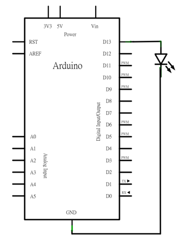

## Arduino入門教學(3) – LED 控制實驗 (作者：Copper Maa)

### Lab1 Blinking a LED

#### 實驗目的

讓一顆燈號閃爍，每隔一秒切換一次燈號。 

#### 材料

* Arduino 主板 x 1
* LED x 1

#### 接線

* 把 LED 接到 Arduino 板子上，LED 長腳(陽極)接到 pin13，短腳(陰極)接到 GND，如下圖： 


#### 電路圖



如果你有電子背景，你可能注意到了一件事，我們的 LED 沒有串接電阻，這是因為 Arduino 的輸出電流很小不會燒壞 LED，所以才敢這麼做。少接一顆電阻是為了簡化，這樣初學者會學得比較輕鬆。一般來說，LED 串接一顆電阻是個好主意。 

#### 程式碼

```CPP
/*
  Blink
  Turns on an LED on for one second, then off for one second, repeatedly.
 
  This example code is in the public domain.
 */

void setup() {                
  // initialize the digital pin as an output.
  // Pin 13 has an LED connected on most Arduino boards:
  pinMode(13, OUTPUT);     
}

void loop() {
  digitalWrite(13, HIGH);   // set the LED on
  delay(1000);              // wait for a second
  digitalWrite(13, LOW);    // set the LED off
  delay(1000);              // wait for a second
}
```

#### 說明： 

* L11: pinMode(13, OUTPUT) 這行把 pin13 設置成 output pin
* L15: digitalWrite(13, HIGH) 這行供應 5V 電壓到 pin13，藉此打開 LED 燈號
* L16: delay(1000) 讓 CPU 閒置一秒鐘，讓 LED 燈號亮著一秒鐘
* L17: digitalWrite(13, LOW) 關閉燈號
* L18: delay(1000) 讓 CPU 閒置一秒鐘，讓 LED 燈號關閉一秒鐘

註：這支是 Arduino 內建的範例程式，點選 File > Examples > 1.Basics > Blink 就可以找到。

#### 範例照片／影片

Youtube 上正好有段講解 Blinking a LED 的影片，我們來看看他的示範：

影片名稱								網址
-----------------------------			-------------------------------
How-to Tuesday: Arduino 101 the LED		   <http://youtu.be/pMV2isNm8JU>


### 實驗二：使用按鍵控制 LED 燈號

#### 實驗目的

使用按鍵 (PushButton)控制 LED 燈號的開關，當按鍵被按下時打開 LED 燈號，按鍵放開時關閉 LED 燈號。 

#### 材料
* Arduino 主板 x 1
* LED x 1
* PushButton 或 Switch 開關 x 1
* 10K 電阻 x 1
* 麵包板 x 1
* 單心線 x N

#### 接線

* 把 LED 接到 pin13，長腳(陽極)接到 pin13，短腳(陰極)接到 GND
* PushButton 一支腳接到 +5V
* pin2 接到 Pushbutton 的另一支腳，同一支腳位接一個 10K 電阻連到 GND


#### 電路圖


#### 程式碼

```CPP
const int buttonPin = 2;     // the number of the pushbutton pin
const int ledPin =  13;      // the number of the LED pin

// variables will change:
int buttonState = 0;         // variable for reading the pushbutton status

void setup() {
  // initialize the LED pin as an output:
  pinMode(ledPin, OUTPUT);      
  // initialize the pushbutton pin as an input:
  pinMode(buttonPin, INPUT);     
}

void loop(){
  // read the state of the pushbutton value:
  buttonState = digitalRead(buttonPin);

  // check if the pushbutton is pressed.
  // if it is, the buttonState is HIGH:
  if (buttonState == HIGH) {     
    // turn LED on:    
    digitalWrite(ledPin, HIGH);  
  } 
  else {
    // turn LED off:
    digitalWrite(ledPin, LOW); 
  }
}
```

#### 說明： 
* L01~L02: 定義按鍵與 LED 的腳位，按鍵接在 pin2, 而 LED 接在 pin13
* L16: 讀取按鍵的狀態並保存到 buttonState 變數裏
* L20~L26: 這支程式的目的是按下按鍵時要打開 LED 燈號，放開按鍵時要關閉 LED 燈號，因此，假如 buttonState 為 HIGH，代表按鍵狀態是按下(pressed)的，此時要打開 LED，反之，假如 buttonState 為 LOW，代表按鍵狀態是放開的，此時要關閉 LED

註：這支是 Arduino 內建的範例程式，點選 File > Examples > 2.Digital > Button 就可以找到。

#### 範例照片／影片

Youtube 上正好有段講解使用按鍵控制 LED 的影片，我們來看看他的示範： 

影片名稱									網址
--------------------------------------		-------------------------------
How-to Tuesday: Arduino 101 the button		   <http://youtu.be/XUuXq4J4u14>


注意！影片所用的範例程式，它是按下按鍵時關閉 LED 燈號，放開按鍵時打開 LED 燈號，邏輯與本文的範例相反。 

#### 動動腦

在不修改程式碼的條件下，讓 LED 變成在正常情況下是亮的，而當按下按鍵時讓 LED 燈號關掉。提示：條件是不能修改程式碼，要改變這支程式的行為，你只能夠動接線。

#### 說明： 
* L01~L02: 定義按鍵與 LED 的腳位，按鍵接在 pin2, 而 LED 接在 pin13
* L16: 讀取按鍵的狀態並保存到 buttonState 變數裏
* L20~L26: 這支程式的目的是按下按鍵時要打開 LED 燈號，放開按鍵時要關閉 LED 燈號，因此，假如 buttonState 為 HIGH，代表按鍵狀態是按下(pressed)的，此時要打開 LED，反之，假如 buttonState 為 LOW，代表按鍵狀態是放開的，此時要關閉 LED

註：這支是 Arduino 內建的範例程式，點選 File > Examples > 2.Digital > Button 就可以找到。

(本文作者為馬萬圳，原為網誌上的兩篇文章，經作者授權給程式人雜誌後由陳鍾誠編輯為此文，原文連結如下 <http://coopermaa2nd.blogspot.tw/2010/12/arduino-lab1-blinking-led.html>, <http://coopermaa2nd.blogspot.tw/2010/12/arduino-lab2-led.html> )

