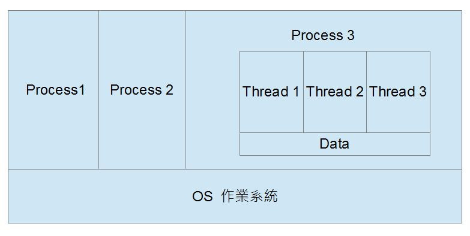
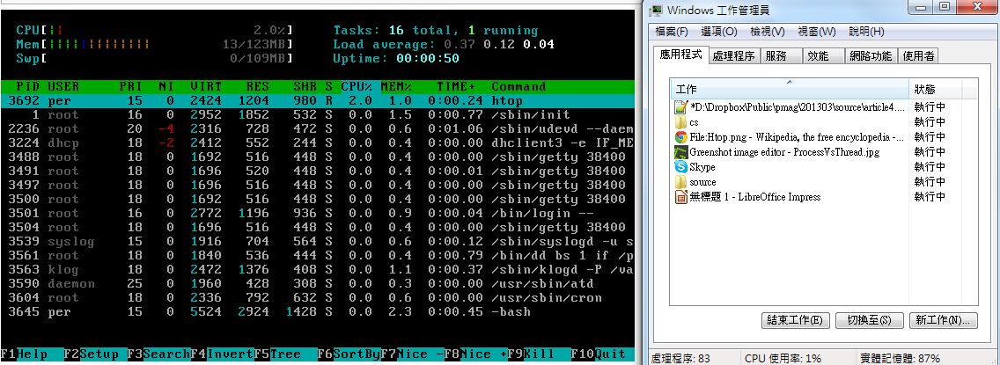
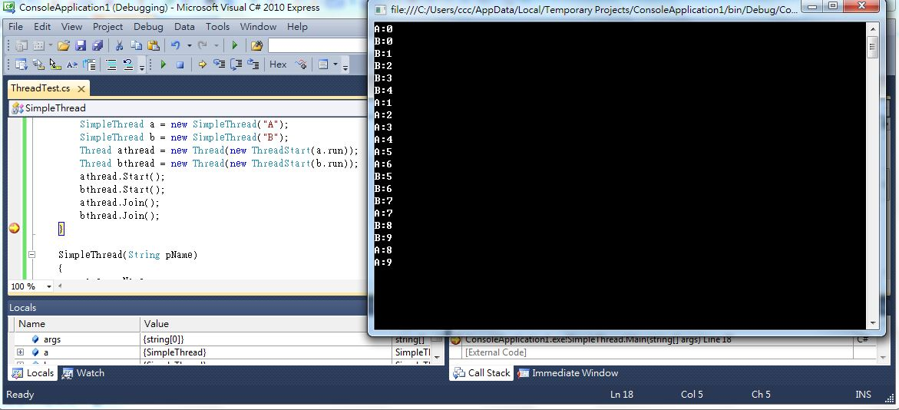
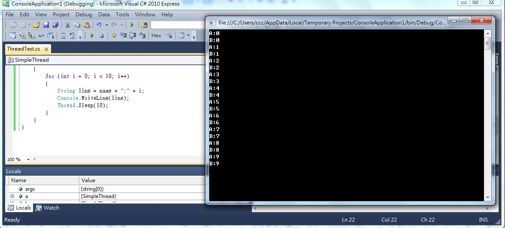
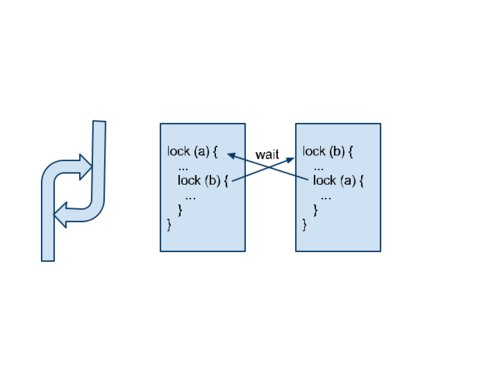
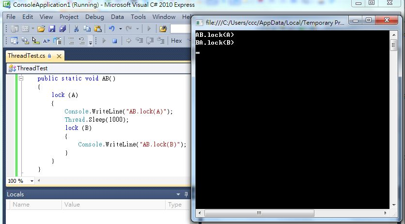

## 從 C# 看作業系統：(1) Thread 與 Deadlock 實作 -- (作者：陳鍾誠)

很多資工系的學生都上過作業系統這門課，但是通常老師只有講理論，沒有說明如何實作，這讓很多同學都無法清楚的理解其中的概念。在本系列文章中，我們將使用 C# 語言來說明作業系統當中的一些關鍵概念，像是 Process (進程、行程、Task)、Thread (執行緒、線程)、Deadlock (死結)、Race Condition (競爭情況)、Semaphore (號誌、信號量) 等等。

### Process 與 Thread

Thread 在台灣被稱為『執行緒』，但是在中國被稱為『線程』，作業系統教科書中通常會定義 Process 為：執行中的程式。因此假如您開了一個 Word 檔案，那就是有一個 Word 行程在執行，如果您又開了個命令列，那就是又有一個命令列行程在執行，如果又開第二個命令列，那就有兩個命令列行程在執行。

Thread 在作業系統中通常被定義為輕量級行程 (Light Weight Process)，一個 Process 可以包含很多個 Thread，如下圖所示：



每個 Process 與 Thread 都會執行，而且執行到一半很可能就會因為進行輸出入或佔用 CPU 過久而被作業系統切換出去，改換另一個 Process 或 Thread 執行，這種概念稱為 Multitasking (多工)。

在 Windows 當中，我們可以按下 Ctrl-Alt-Del 鍵以顯示出系統的行程資訊，而在 Linux 中則可以用 ps (Process Status) 這個指令顯示行程資訊，以下是這兩個作業系統中的行程資訊範例。



Thread 交替執行的這種慨念可以用下圖表示。(Proces 也是如此，只是將圖中的 Thread 改為 Process 而已)


### C# 中的 Thread 概念

在現代的作業系統當中，如果我們將一個程式重複執行兩次，將會產生兩個 Process ，那麼這兩個程式將是毫不相關的。任何一個程式都不需要知道另一個程式是否存在，通常也不會與另一個程式進行溝通。

但是，如果我們希望兩個程式能夠互相分享某些變數，但是卻又同時執行，此時就可以利用 Thread 的機制。對於程式設計師而言，Thread 就像一個可以單獨執行的函數，這個函數與其他程式 (包含主程式) 同時執行，感覺上好像互相獨立，但是又可以共用某些變數。以下是一個 C# 的 Thread 範例：

```CS
using System;
using System.Threading;

class SimpleThread
{
    String name;

    public static void Main(String[] args)
    {
        SimpleThread a = new SimpleThread("A");
        SimpleThread b = new SimpleThread("B");
        Thread athread = new Thread(a.run);
        Thread bthread = new Thread(b.run);
        athread.Start();
        bthread.Start();
        athread.Join();
        bthread.Join();
    }

    SimpleThread(String pName)
    {
        name = pName;
    }

    public void run()
    {
        for (int i = 0; i < 10; i++)
        {
            String line = name + ":" + i;
            Console.WriteLine(line);
            // Thread.Sleep(10);
        }
    }
}
```

其執行結果如下圖所示：



對於剛開始接觸 Thread 的程式人員而言，會感覺到相當的詭異。因為『兩個 Thread 同時執行』是一個相當難以理解的概念。事實上，對於只有一個 CPU 的程式而言，並非兩個程式真的會「同時」執行，而只不過是「交錯」執行而已。但是這個交錯方式是由作業系統決定的，而非由程式設計師自行安排。而對於多 CPU 或多核心的處理器而言，就真的會「同時」執行，而不是只有「交錯」執行而已。

通常，程式人員對於這種不能由自己操控決定的情況會有不安的感覺，但是當您多寫幾個程式之後，這種疑慮就會消除了，畢竟，程式人員本來就相當依賴作業系統，只是自己通常感覺不到而已。

當然，如果我們想要稍微控制一下 Thread 的執行順序，那麼就可以要求目前的 Thread 去休息睡覺，像是上述程式中的 Thread.Sleep(10) 這行程是本來是被註解掉的，但是如果我們將這行程式的註解拿掉，那麼將得到下列執行結果。



從上面兩個圖中，您可以看到還沒加入 Thread.Sleep(10) 之前，兩個 Thread 的交錯方是很隨興，基本上是由作業系統任意安排的，但是在加入 Thread.Sleep(10) 之後，因為兩個 Thread 在印一次後就會禮讓給對方，所以就成了嚴格交互的 A, B, A, B .... 之情形了。

### 以 C# 體驗 Deadlock 死結

在作業系統的課程當中我們會學到『死結』這個問題，當程式 1 抓住資源 A，卻又在等程式 2 釋放資源 B，而程式 2 則抓住資源 B ，卻又在等程式 1 釋放資源 A 的時候，就會進入死結狀態。這就像兩台很長的火車，互相卡住對方一般，下圖顯示了死結情況的示意圖。



在程式設計中我們真的會遇到死結嗎？如果真的有死結，能否寫一個會造成死結的程式呢？

這並不難，只要用執行緒 (Thread) 與鎖定 (lock) 機制，我們很容易就可以造出會導致死結的程式，以下是我們用 C# 撰寫的一段死結程式，請參考。

```CS
using System;
using System.Threading;
using System.Text;

class ThreadTest
{
    static String A = "A";
    static String B = "B";

    public static void Main(String[] args)
    {
        Thread thread1 = new Thread(AB);
        Thread thread2 = new Thread(BA);
        thread1.Start();
        thread2.Start();
        thread1.Join();
        thread2.Join();
    }

    public static void AB()
    {
        lock (A)
        {
            Console.WriteLine("AB.lock(A)");
            Thread.Sleep(1000);
            lock (B)
            {
                Console.WriteLine("AB.lock(B)");
            }
        }
    }

    public static void BA()
    {
        lock (B)
        {
            Console.WriteLine("BA.lock(B)");
            Thread.Sleep(1000);
            lock (A)
            {
                Console.WriteLine("BA.lock(A)");
            }
        }
    }
}
```

上述程式的執行結果如下圖所示，當程式跑到 BA.lock(B) 之後就進入了死結，再也無法跑下去了，因此我們不會看到 BA.lock(A) 與 AB.lock(B) 這兩行輸出的結果，程式已經進入了死結狀態，再也出不來了。



至此，我們已經用 C# 實作了作業系統中的 Thread 與 Deadlock 這兩種慨念，以便讓讀者能透過實作真正的去感受作業系統，希望這樣的說明方式對讀者會有所幫助。

在下一期當中，我們將繼續利用 C# 說明作業系統中的 Race Condition (競爭情況) 概念與利用 lock 及 Semaphore 機制避免 Race Condition 的方法，我們下期見！


