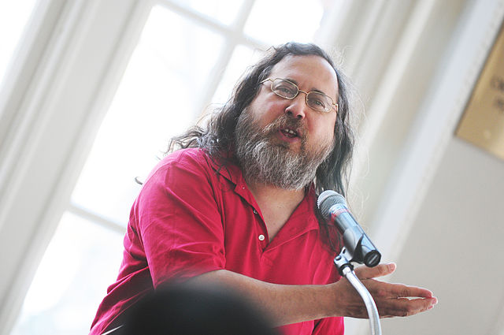

## 開放原始碼之父–Richard Stallman

Richard Stallman 是開放原始碼領域最知名的人物之一，也是創造整個開源文化的始祖，他於 1983 年創建了 GNU 計畫，想建立一個類似 UNIX 的作業系統，雖然這個作業系統卻遲遲未能完成，但是 GNU 卻創造出了完成這個作業系統的大部分工具，像是 gcc, gdb, glibc, Emacs 等等，這讓後來的 (Linus Torvalds) 能夠在此基礎上創造出 Linux。

另外、Stallman 也創造出 GPL (GNU General Public License) 這個重要的開放原始碼授權，並且找了律師一起制定相關的法律條款，位開放原始碼的發展奠定了法律基礎。2001 年時，Lawrence Lessig 也是受到這類授權的啟發而創造出了 Creative Commons 創作共用授權，讓開放原始碼文化擴散到一般領域。

根據 Stallman 的傳記，他是因為想要改良一台 Xerox 9700 的雷射印表機的功能，槓上了全錄公司，由於該印表機沒有附上驅動程式的原始碼，並且拒絕 Stallman 等人的索取程式碼，所以才引發了他推展開放原始碼運動的想法。

這個故事告訴我們，有時候毫不起眼的小事，會改變你的一生，然後讓你變成偉人！

【本文由陳鍾誠取材並修改自維基百科】

